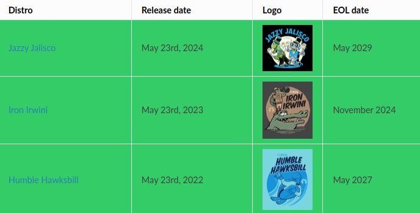
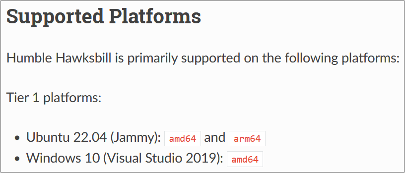

Preparatory Work 1
==================

Why ROS2?
---------

ROS2, or Robot Operating System 2, is the successor to ROS1, featuring enhanced capabilities. Simply put, ROS2 is a collection of tools and libraries that provide a standardized middleware for developing robotic applications, promoting code reuse and efficiency. ROS2 is particularly well-suited for building scalable and complex robotic systems that require robust communication, such as those with multiple sensors and actuators.

Here are some key benefits of using ROS2:

* **Code Separation:** Enhanced modularity and reusability
* **Communication Tools:** Simplifies interactions between subprograms
* **Tools and Libraries:** Offers many ready-to-use resources
* **Language-Agnostic:** Supports multiple languages, primarily Python and C++
* **Improved Performance:** Better scalability, real-time capabilities, and security over ROS1

Selecting a ROS2 Distribution
-----------------------------

ROS2 is released through distributions, which are collections of ROS2 packages and tools, on an annual basis. When starting a ROS2 project, the first decision you need to make is which distribution (or "distro") to use. How should you choose? The key distinction to understand is that ROS2 alternates between Long-Term Support (LTS) versions, which receive 5 years of support, and non-LTS versions, which are supported for 2 years.

   `List of ROS2 Distributions <https://docs.ros.org/en/humble/Releases.html>`_

Non-LTS versions are primarily intended for testing new features and tools and are generally not recommended for starting new projects. Instead, LTS versions are preferred, especially one that has been released for at least a few months, to ensure stability and the availability of necessary resources. Additionally, each ROS2 distribution is adapted to work with specific operating systems, most commonly the latest Ubuntu LTS release. The official ROS2 documentation provides the End of Life (EOL) date for each version, indicating the period during which stability and maintenance are guaranteed.

   `Humble Hawksbill Supported Platforms <https://docs.ros.org/en/humble/Releases/Release-Humble-Hawksbill.html>`_

Key points to consider when choosing a distribution:

* **EOL Date**: Ensure the distribution will be supported for the duration of your project
* **LTS Version**: Opt for an LTS release, preferably one that has been available for several months
* **Supported Platform**: Verify that the "distro" is compatible with your OS, typically Ubuntu LTS

For this course, we will use the **Humble Hawksbill** distribution, as it meets all of these recommendations. It is an LTS version, supported until May 2027. However, the best-supported platform for this distribution is Ubuntu 22.04 (Jammy Jellyfish), which could be a critical consideration for the course. In the next section, we will explore how to address this issue.

Why Docker?
---------------

In the previous section, we identified a potential issue with the ROS2 Humble distribution, which requires a specific operating system. In our case, the most suitable platform is Ubuntu 22.04. But how can we all work with Ubuntu on our own computers, regardless of our current setup? This is where Docker comes in.

Docker is a platform that allows you to package and run applications in isolated environments called *containers*. It ensures that the software behaves consistently, no matter where it is run, by providing everything the application needs, including the OS, libraries, and dependencies.

But how does Docker achieve this?

- **Docker Image:** An image is essentially a blueprint for a container. It contains the necessary software, dependencies, and system configurations. Think of it as a snapshot of a specific environment, such as Ubuntu 22.04 with ROS2 pre-installed. When you want to run an application, Docker uses this image to create a container.

- **Docker Container:** A container is an instance of an image. It is a lightweight, isolated environment where your application runs. The container shares the OS kernel with your host machine but remains isolated in terms of processes, file system, and network settings. This ensures that the container runs in a clean, consistent environment without interfering with your local setup.

In conclusion, Docker allows us to work in a clean, reproducible environment perfectly suited for our ROS2 application. For easier management, we willl use Docker Desktop, which provides a more user-friendly interface for handling containers.

In the next section, you will see the steps needed to access an Ubuntu desktop directly from your browser using Docker.

Installing Docker Desktop
-------------------------

1. **Install Docker Desktop**

   Follow the instructions for installing Docker Desktop based on your operating system:

   - **Windows**: `Install Docker Desktop on Windows <https://docs.docker.com/desktop/install/windows-install/>`_
   - **Mac**: `Install Docker Desktop on Mac <https://docs.docker.com/desktop/install/mac-install/>`_
   - **Linux**: `Install Docker Desktop on Linux <https://docs.docker.com/desktop/install/linux/>`_

   .. admonition:: Need help?
   
      If you encounter any issues during installation, please do not hesitate to contact us.

2. **Configure Docker**

   After installation, configure Docker by clicking on ``Accept``, selecting ``Use recommended settings``, and then clicking on ``Finish``. You can then *Continue without signing in* and *skip* the subsequent questions.

3. **Pull the Docker Image**

   On the Docker Desktop, use the search bar to find the image named **luky005/ros2_basics** and pull it.

4. **Locate the Image**

   Once the image is downloaded, find it in the *Images* section on the left sidebar.

5. **Run the Container**

   Start the container by clicking the ``▶`` symbol.

6. **Set Optional Settings**

   Open the *Optional settings* tab and fill in the following fields:

   1. Set the container name to **ros2_basics**.
   2. Set the port to **6080**.

7. **Launch the Container**

   Click the ``Run`` button to launch the container.

8. **Access Ubuntu**

   After the container has launched, you can access Ubuntu from your favorite browser at http://localhost:6080.

9. **Connect to Your Desktop**

   Finally, click on ``Connect`` to access your new desktop for these lab sessions.

.. important::

   To access the Ubuntu desktop in the future, navigate to the *Containers* section on the left sidebar. Click the ``▶`` symbol next to your container to start it directly.

   Additionally, you can open your browser directly to *http://localhost:6080* by clicking on the **6080:80** port located on the left side of the ``▶`` symbol. This allows you to quickly connect to the VNC server.

Exploring Tools
---------------

As mentioned earlier, Ubuntu comes with ROS2 pre-installed, along with several essential tools. On the desktop, you will find Firefox, VSCode, and Terminator. Below is a brief overview of each application:

* **Firefox**: The web browser that will allow you to access online documentation, including resources on Read the Docs.

* **VSCode**: Visual Studio Code (VSCode) is the Integrated Development Environment (IDE) we will use to write our code. It is suitable for ROS2 development, offering essential features like syntax highlighting and code completion.

.. admonition:: Remark

   If you prefer using different tools or editors, you are welcome to download and install them on your desktop. Customize your workspace to suit your preferences and workflow!

* **Terminator**: This enhanced terminal emulator allows you to split your screen and manage multiple terminal sessions simultaneously. This feature is especially useful when working with ROS2, as you will see in session 1.

  Here are some useful shortcuts for splitting the terminal:

  * ``Ctrl+Shift+O``: Horizontal split
  * ``Ctrl+Shift+E``: Vertical split

  You can also right-click on the Terminator window to access similar options for splitting the terminal.

Learning Basic Linux Commands
-----------------------------

As we prepare for our practical lab sessions with ROS2, being familiar with the terminal will be helpful. Here are some key Linux commands you will find useful throughout this course:

**Essential Commands**

* **mkdir <directory>**: Create a new directory
* **cd <directory>**: Change the current directory
* **ls**: List directory contents
* **touch <file>**: Create an empty file
* **chmod +x <file>**: Make a file executable

**Useful Commands**

* **pwd**: Display the full path of the current working directory
* **cat <file>**: Display file contents
* **nano <file>**: Basic text editor for editing files
* **cp <source> <destination>**: Copy files or directories
* **mv <source> <destination>**: Move and/or rename files or directories
* **rm <file>**: Delete files
* **rmdir <directory>**: Remove an empty directory
* **rm -r <directory>**: Recursively delete directories and contents

To reinforce your understanding of these commands, we invite you to participate in a command-line game designed to practice your skills!

Command-Line Game
~~~~~~~~~~~~~~~~~

**Objective** 

Explore a virtual file system and complete tasks using the commands you have learned.

**Instructions**

1. **Setup the Game Environment**

   Open your terminal and create a game directory:

   .. code-block:: bash

      mkdir command_game
      cd command_game

   Inside *command_game*, create a basic structure:

   .. code-block:: bash

      mkdir -p game/{documents,images,videos}
      touch game/documents/{notes.txt,tasklist.txt}
      touch game/images/{pic1.jpg,pic2.jpg}
      touch game/videos/video1.mp4

2. **Starting the Game**

   You are now in the *command_game* directory. Your objective is to complete the following tasks using your knowledge of Linux commands. Before reviewing the solutions, try to figure out the necessary commands on your own. Good luck!

.. tip::
   
   Before and after each command, use ``ls`` to observe the changes in your directory.

**Tasks**

.. tabs::

   .. tab:: Task 1

      Navigate to the *documents* directory

   .. tab:: Solution 1

      .. code-block:: bash

         cd game/documents

.. tabs::

   .. tab:: Task 2

      List the contents of the *documents* directory

   .. tab:: Solution 2

      .. code-block:: bash

         ls

.. tabs::

   .. tab:: Task 3

      Create a new text file called *summary.txt*

   .. tab:: Solution 3

      .. code-block:: bash

         touch summary.txt

.. tabs::

   .. tab:: Task 4

      Write a brief summary text in *summary.txt*, then save and exit

   .. tab:: Solution 4

      .. code-block:: bash

         nano summary.txt

      Example content: "This is a summary text."

      To save, press: ``Ctrl + S``

      To exit, press: ``Ctrl + Shift + X``

.. tabs::

   .. tab:: Task 5

      Display the contents of *summary.txt*

   .. tab:: Solution 5

      .. code-block:: bash

         cat summary.txt

.. tabs::

   .. tab:: Task 6

      Return to the main *game* directory

   .. tab:: Solution 6

      .. code-block:: bash

         cd ..

.. tabs::

   .. tab:: Task 7

      Check the full path of your current working directory

   .. tab:: Solution 7

      .. code-block:: bash

         pwd

.. tabs::

   .. tab:: Task 8

      Navigate to the *images* directory

   .. tab:: Solution 8

      .. code-block:: bash

         cd images

.. tabs::

   .. tab:: Task 9

      Remove *pic2.jpg*

   .. tab:: Solution 9

      .. code-block:: bash

         rm pic2.jpg

.. tabs::

   .. tab:: Task 10

      Go back to the *game* directory and remove the *videos* directory

   .. tab:: Solution 10

      .. code-block:: bash

         cd .. && rm -r videos

.. tabs::

   .. tab:: Task 11

      Copy *pic1.jpg* from the *images* directory to the *game* directory

   .. tab:: Solution 11

      .. code-block:: bash

         cd images/ && cp pic1.jpg ..

.. tabs::

   .. tab:: Task 12

      Rename *pic1.jpg* to *my_pic.jpg* in the *game* directory

   .. tab:: Solution 12

      .. code-block:: bash

         cd .. && mv pic1.jpg my_pic.jpg

.. tabs::

   .. tab:: Task 13

      Change the permissions of *my_pic.jpg* to make it executable

   .. tab:: Solution 13

      .. code-block:: bash

         chmod +x my_pic.jpg

.. tabs::

   .. tab:: Task 14

      Clean up your game by removing the *game* directory

   .. tab:: Solution 14

      .. code-block:: bash

         cd ../.. && rm -r command_game