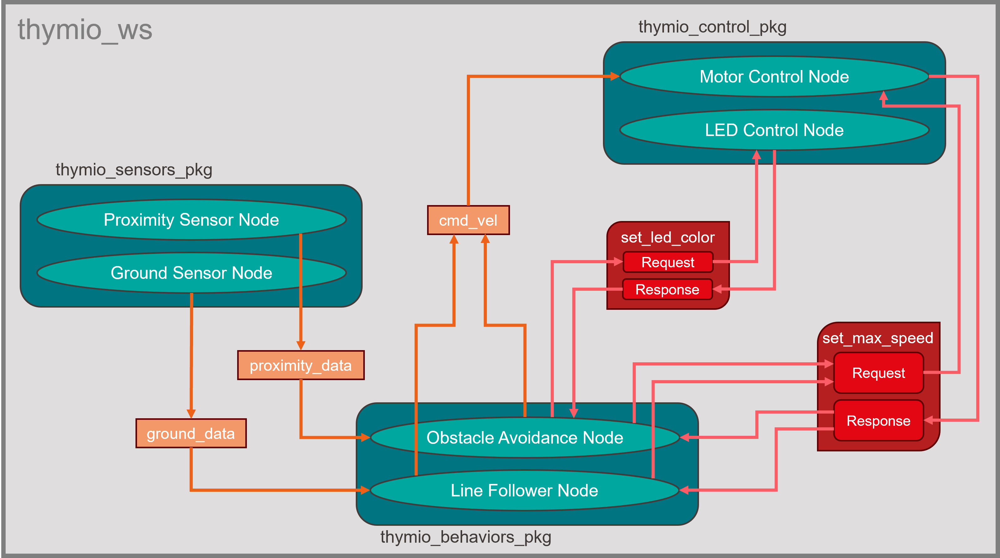

Preparatory Work 2
==================

Thymio Example
--------------

Let's be honnest, the previous session was quite intense! We covered a lot of foundational topics, and it is perfectly normal if everything is not fully clear yet. Today, we will go through an example to give you a practical reminder of what we learned. By the end, you should have a better idea of how a ROS2 project is typically structured and how its core components work together.

Here, we will use an example with the Thymio robot, which you can see in the image below. This diagram represents a ROS2 project setup for the Thymio, organized into different components that reflect the main concepts we covered: workspaces, packages, nodes, topics, and services. Let’s go through each part to see how these concepts come to life in a real project.

    Thymio Example - Overview of a ROS2 project structure

**Workspace**

Think of the workspace as the main project folder. In ROS2, all your packages live within a workspace, making it a hub for development. In our example, the workspace is called ``thymio_ws``. Inside, you will find separate packages, each dedicated to specific parts of the robot’s functionality, which makes the project modular and easy to manage.

**Packages**

In ROS2, we organize code into packages, which are like mini-projects within the workspace, each with its own role.

    * ``thymio_sensors_pkg``: This package handles data from the robot’s sensors, like proximity and ground sensors.
    * ``thymio_behaviors_pkg``: This package is where the robot's behavior logic lives, such as obstacle avoidance and line-following. It uses sensor data to decide on actions.
    * ``thymio_control_pkg``: This package is responsible for controlling the robot’s hardware, like the motors and LEDs, based on the decisions made by the behavior nodes.

This structure helps us keep different parts of the robot’s functionality organized and allows us to make changes to one part without affecting others.

**Nodes**

Nodes are individual programs in ROS2 that perform specific tasks. Each package in our example contains nodes that work together to control the Thymio robot:

    * **Sensor nodes**: The ``Proximity Sensor Node`` and ``Ground Sensor Node`` in *thymio_sensors_pkg* collect data from the robot’s environment, publishing it as messages to be used by other nodes.
    * **Behavior nodes**: The ``Obstacle Avoidance Node`` and ``Line Follower Node`` in *thymio_behaviors_pkg* subscribe to the sensor data, analyze it, and make decisions on how the robot should react: moving freely, avoiding obstacles or following a line.
    * **Control nodes**: The ``Motor Control Node`` and ``LED Control Node`` in *thymio_control_pkg* take commands from the behavior nodes and translate them into actions like moving the motors or changing the LED colors.

Nodes allow us to break down complex tasks into simpler parts, making our project more organized and modular.

**Topics**

Nodes often need to share information with each other, and they do this through topics, which are like message channels.

    * **Sensor topics**: The ``Proximity Sensor Node`` and ``Ground Sensor Node`` publish messages to ``proximity_data`` and ``ground_data`` topics, respectively. The behavior nodes subscribe to these topics to get real-time sensor information for decision-making.
    * **Command velocity topic**: When the behavior nodes decide on an action, such as moving forward or turning, they publish commands to the ``cmd_vel`` topic. The ``Motor Control Node`` then subscribes to this topic to execute the movement commands.

Topics help different nodes communicate asynchronously, meaning that they don’t need to wait for each other and can process data as it becomes available.

**Services**

While topics are useful for continuous data streams, sometimes nodes need to perform specific actions at certain times and may require a response. This is where services come in. They are ideal for tasks like performing calculations or adjusting parameters on demand.

    * **set_led-color**: The ``Obstacle Avoidance Node`` might call the ``set_led_color`` service to change the LED color, indicating the robot’s current status: green for free navigation, red for obstacle avoidance or blue for line-following. The service response confirms the new setting by returning the LED color.
    * **set_max_speed**: Both the ``Line Follower Node`` and the ``Obstacle Avoidance Node`` may call the ``set_max_speed`` service to adjust the robot's maximum speed depending on whether it is in line-following or obstacle avoidance mode. The service response provides the updated speed value to confirm the new setting.

In ROS2, a service has a request-response structure, where a node sends a request to a service and waits for a response. This structure is suitable for commands that are not continuous, such as adjusting settings.
    
Exercise 2
----------

.. You are almost done, this is your final challenge! Explore services and custom interfaces to tackle the following exercise.

In session 1, we introduced the basics of services and custom interfaces, but we did not dive into hands-on practice with these concepts. Now, you will take on a new challenge designed to provide practical experience and deepen your understanding of how they operate in ROS2.

Mission Validation Service for a Rover
~~~~~~~~~~~~~~~~~~~~~~~~~~~~~~~~~~~~~~

Create a ROS2 system with a service that validates a rover’s mission before launch. The service will check conditions like temperature, battery level, and distance to the target, then return a decision on mission approval and advice for improvement if needed. 

**Steps**

1. Create a custom service (MissionValidation.srv)

  * Request: temperature (°C), battery_level (%), target_distance (km)
  * Response: success (bool), advice (string), estimated_duration (hours)

2. Create a server node

  * Validate the mission:

    * Safe temperature: -20°C to 50°C
    * Battery level: Above 30%
    * Estimate duration based on distance (speed: 10 km/h)

  * Return false and advice if conditions fail, or true and duration if valid

3. Create a client node

  * Send mission parameters from the client to the server
  * Display the service’s response (approval, and advice or duration)

.. admonition:: Hints

  .. toggle::

    * Utilize the *ros2_basics_interface* to define your custom service
    * Consider developing your nodes in a new package (optional)
    * Use ``colcon build --symlink-install`` to easily test new parameters with the client