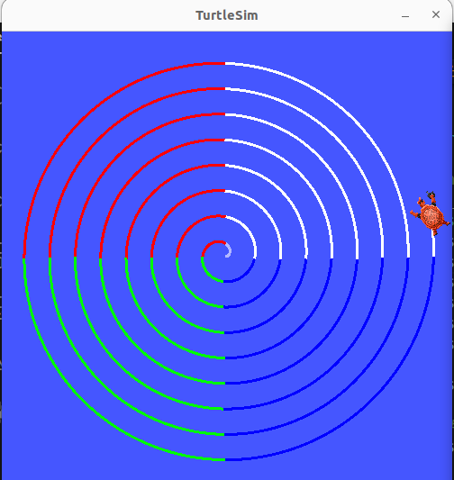
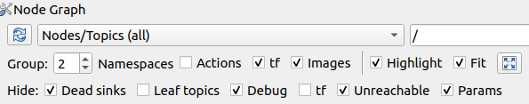
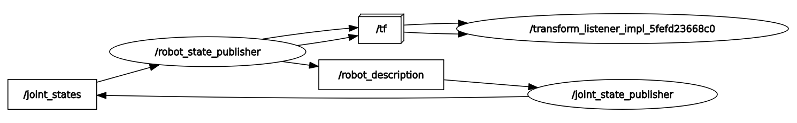
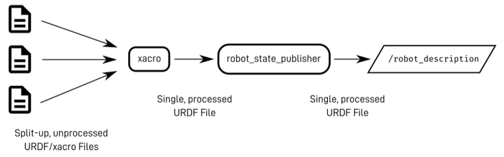
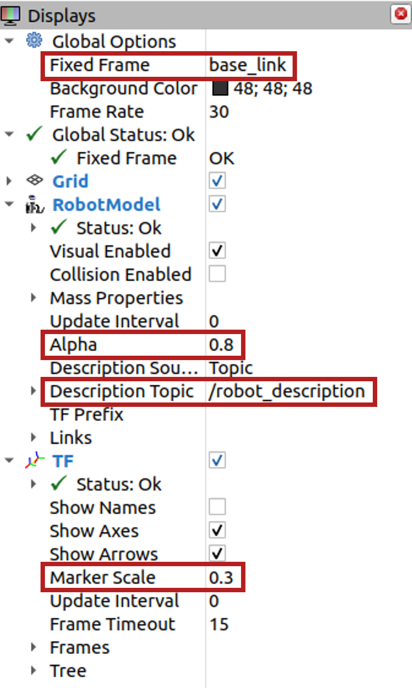

Preparatory Work 3
==================

Your ROS2 journey is almost complete, but before we dive into the final session, it is important to solidify your understanding of key concepts. In the final session, you will be working on a mini-project that will require you to apply your knowledge of **topics** and **services**. To ensure you are fully prepared, we have designed a challenge that will help you review these concepts using one of the most iconic ROS2 packages: **turtlesim**.

This challenge will serve as a foundation for the skills you will need in the mini-project, allowing you to approach the final task with confidence.

Additionally, as mentioned in Session 2, we have included a section to analyze the launch files used in the previous session. While this analysis is not mandatory, it offers valuable insights into how a URDF is handled in ROS2, the role of TFs in tracking robot motion, and the underlying mechanisms that bring robot simulations to life. Feel free to explore this section if you wish to enhance your background knowledge.

Turtlesim Overview
------------------

The *turtlesim* package is a well-known tool for beginners in ROS2, often used to introduce core concepts. It simulates a simple turtle in a 2D space, which you can control using various ROS2 tools. 

Now it is time for you to try this turtle simulation:

1. Open a terminal and launch the *turtlesim* node with the following command:

.. code-block:: bash

    ros2 run turtlesim turtlesim_node

A window with a turtle in the center should appear.

2. In a second terminal, start the *teleop_turtle* node to control the turtle:

.. code-block:: bash

    ros2 run turtlesim turtle_teleop_key

This allows you to control the turtle using your keyboard's arrow keys: ``◄``, ``▲``, ``▼``, ``►``. Try moving the turtle around the screen.

.. warning::

    If the turtle does not move, ensure that the terminal running the *teleop_turtle* node is active. Click inside the terminal and try again.

3. Explore topics and services

Now that you have turtlesim running, let’s explore some of the topics and services it offers.

First, list the available topics:

.. code-block::

    ros2 topic list

This will display the topics that can be used to interact with the turtle. Two of them will be particularly useful for you.

Next, list the available services:

.. code-block::

    ros2 service list

The *turtlesim* package provides several services. You will use one of these to modify the turtle’s behavior.

Exercise 3
----------

Now that you are familiar with *turtlesim*, let's dive into the challenge!

.. raw:: html

    <h3 style="font-size: 1.25em; font-weight: bold; margin: 1em 0;">Turtlesim Challenge</h3>

Run the turtlesim node and create an additional node to control the turtle's movement. The turtle should move in a circular path starting from the center of the *TurtleSim* window, gradually expanding its path toward the boundaries. Ensure that the turtle stops moving near the window boundaries. Additionally, as the turtle moves, change the pen color dynamically when it enters a different quadrant of the *TurtleSim* window.

    Turtlesim challenge final result

.. admonition:: Steps

    1. **Determine the window boundaries** 
    
    Identify :math:`[x_{\text{min}}, x_{\text{max}}]` and :math:`[y_{\text{min}}, y_{\text{max}}]`

    .. tip::

        Use the *teleop_turtle* node to explore the window

    2. **Move the turtle** 

    Send velocity commands at a defined frequency to make the turtle move away from the center

    .. tip::

        Use the following command-lines to find the information you need:

        * List all topics + message type: ``ros2 topic list -t``
        * Get details on a message type: ``ros2 interface show <msg_type>``

    3. **Boundary detection** 

    Stop the turtle when it reaches the boundary limits

    4. **Pen color change** 

    Use a *turtlesim* service to change the pen color as the turtle enters each new quadrant

    .. tip::

        Use the following command-lines to find the information you need:

        * List all services + service type: ``ros2 service list -t``  
        * Get details on a service type: ``ros2 interface show <srv_type>``

    .. warning::

        Only call the service when the turtle transitions between quadrants, not continuously.

.. note::

    To review the concepts from a different perspective, consider checking out this tutorial featuring the *turtlesim* package: `ROS2 Tutorial <https://www.youtube.com/watch?v=Gg25GfA456o>`_

Simulation Underlays - Optional
-------------------------------

This section is optional and is here to satisfy your curiosity if you wish to explore further. It dives into how simulation is achieved in ROS2, offering a detailed analysis of the underlying processes. In the previous session, we focused on creating a URDF file, or multiple Xacro files, that define the structure and properties of the Thymio robot. We then provided you with launch commands to visualize the robot in Rviz and Gazebo. However, behind the scenes, several essential ROS2 nodes are responsible for making this possible. In this section, we will break down these components and analyze how they work together, giving you a deeper understanding of the integration process.

Let’s run *thymio_display_xacro.launch.xml*, which enables us to visualize the Thymio model in Rviz and interact with a GUI to adjust joint positions, focusing on the robot's structure without Gazebo.

1. Launch *thymio_display_xacro.launch.xml*

.. code-block:: bash

    cd ~/ros2_basics_ws
    source install/setup.bash
    ros2 launch thymio_description thymio_display_xacro.launch.xml

2. Visualize the graph

.. code-block:: bash

    rqt_graph 

3. Configure the *Node Graph*

.. |spacer| raw:: html

    

|spacer|

Looking at the *rqt_graph*, we see two main nodes interacting: ``joint_state_publisher`` and ``robot_state_publisher``. The ``robot_state_publisher`` handles TFs in ROS2 by relying on joint information published by the ``joint_state_publisher``. In this case, the ``joint_state_publisher`` is a GUI tool that lets us adjust joint positions virtually. In a real-world scenario, joint positions would be published by hardware sensors, such as encoders.

|spacer|

For the ``robot_state_publisher`` to work, it needs the URDF, which defines the robot's structure and joint placements. This URDF file is passed as a parameter during the launch process. But where exactly can we find it? Let’s explore this:

1. List the different nodes

.. code-block:: bash

    ros2 node list

2. List the parameter of the ``robot_state_publisher`` node

.. code-block:: bash

    ros2 param list /robot_state_publisher 

3. Check the content of the *robot_description* parameter

.. code-block:: bash

    ros2 param get /robot_state_publisher robot_description 

Now that we have located the parameter containing the Thymio robot’s URDF, let’s take a closer look. This parameter holds the complete description of the robot, which was originally split across multiple files. Using the *xacro* tool, these files were combined into a single, unified URDF. You can confirm this in the terminal, where the file header states: *This document was autogenerated by xacro*.

To summarize, let’s refer to the following image for a visual representation:

    `Describing robots with URDF (Articulated Robotics) <https://articulatedrobotics.xyz/tutorials/ready-for-ros/urdf>`_

Here’s a quick recap of the roles of the two nodes:

* ``robot_state_publisher``:

    * Updates the robot model and TFs in real-time
    * Requires the URDF file as a parameter to define the robot's structure
    * Relies on joint position data to reflect changes in the robot's state

* ``joint_state_publisher``:

    * Provides virtual joint positions in simulation
    * Replaced by hardware sensors, such as encoders, in real-world applications

Having explored the key components of the launch process, let's now run each node individually in separate terminals to verify if they produce the same outcome.

1. Run the ``robot_state_publisher`` node

From the previous explanation, we need to launch the ``robot_state_publisher`` node and provide the URDF file as a parameter. Additionally, we must use the *xacro* tool to combine the Xacro files into a single URDF file.

.. code-block:: bash

    ros2 run robot_state_publisher robot_state_publisher --ros-args -p robot_description:="$(xacro /home/ubuntu/ros2_basics_ws/install/thymio_description/share/thymio_description/urdf/thymio/thymio.urdf.xacro)"

2. Run the ``joint_state_publisher`` node

.. code-block:: bash

    ros2 run joint_state_publisher_gui joint_state_publisher_gui 

3. Run *Rviz*

.. code-block:: bash

    ros2 run rviz2 rviz2

At this stage, nothing is visible in Rviz. To proceed, you need to configure the interface with the required display settings. Start by adding the ``RobotModel`` and ``TF`` plugins, and then adjust their options as follows:

|spacer|

.. note::

    If desired, you can save your current Rviz configuration to avoid reconfiguring everything each time. Save the configuration in the *rviz* directory of the *thymio_description* package by navigating to *File > Save Config As* in RViz and selecting the appropriate location. To try it out, adjust ``<config_name>.rviz`` in the following command with the name of your saved configuration:

    .. code-block:: bash

        ros2 run rviz2 rviz2 -d "/home/ubuntu/ros2_basics_ws/install/thymio_description/share/thymio_description/rviz/<config_name>.rviz"

4. Run *rqt_graph*

Finally, as expected, observe that the result matches exactly what was achieved using the *thymio_display_xacro.launch.xml* file, where the three executables are launched with identical arguments. The content of the launch file is provided below:

.. code-block:: xml

    <launch>
        <arg name="urdf_path"
            default="$(find-pkg-share thymio_description)/urdf/thymio/thymio.urdf.xacro"/>

        <arg name="rviz_config_path"
            default="$(find-pkg-share thymio_description)/rviz/rviz_config.rviz" />

        <node pkg="robot_state_publisher" exec="robot_state_publisher">
            <param name="robot_description" value="$(command 'xacro $(var urdf_path)')"/>
        </node>

        <node pkg="joint_state_publisher_gui" exec="joint_state_publisher_gui"/>

        <node pkg="rviz2" exec="rviz2" args="-d $(var rviz_config_path)" />
    </launch>

.. note::

    For comparison, below is the Python equivalent of the same launch file. While Python launch files can be slightly more complex to write, they offer greater flexibility.

    .. toggle::

        .. code-block:: python

            import os
            from launch_ros.actions import Node
            from launch import LaunchDescription
            from launch.substitutions import Command
            from launch_ros.parameter_descriptions import ParameterValue
            from ament_index_python.packages import get_package_share_path

            def generate_launch_description():

                urdf_path = os.path.join(get_package_share_path('thymio_description'),
                                        'urdf', 'thymio.urdf.xacro')
                
                rviz_config_path = os.path.join(get_package_share_path('thymio_description'),
                                                'rviz', 'rviz_config.rviz')

                robot_description = ParameterValue(Command(['xacro ', urdf_path]), value_type=str)

                robot_state_publisher_node = Node(
                    package="robot_state_publisher",
                    executable="robot_state_publisher",
                    parameters=[{'robot_description': robot_description}]
                )

                joint_state_publisher_gui_node = Node(
                    package="joint_state_publisher_gui",
                    executable="joint_state_publisher_gui"
                )

                rviz2_node = Node(
                    package="rviz2",
                    executable="rviz2",
                    arguments = ["-d", rviz_config_path]
                )

                return LaunchDescription([
                    robot_state_publisher_node,
                    joint_state_publisher_gui_node,
                    rviz2_node
                ])

Now, let's add the components needed to use the Thymio robot in Gazebo:

1. Launch *thymio_display_xacro.launch.xml*

.. code-block:: bash

    ros2 launch thymio_description thymio_display_xacro.launch.xml 

2. Launch *Gazebo*

.. code-block:: bash

    ros2 launch gazebo_ros gazebo.launch.py

3. Spawn the Thymio in Gazebo

.. code-block:: bash

    ros2 run gazebo_ros spawn_entity.py -topic robot_description -entity thymio

.. note::
    
    These commands are provided by the *gazebo_ros* package, which serves as the interface connecting ROS2 and Gazebo.

At this stage, the Thymio robot should successfully spawn in Gazebo. However, you may notice warning messages in the terminal where *thymio_display_xacro.launch.xml* was started. These warnings occur due to a conflict between the ``joint_state_publisher_gui`` node and the ``gazebo_ros_diff_drive`` plugin, as both attempt to provide information about the wheel positions. To resolve this conflict, the ``joint_state_publisher_gui`` node must not be executed.

This adjustment was already implemented in the final launch file used at the end of the previous session. Below is the content of the final launch file, *thymio.launch.xml*:

.. code-block:: xml

    <launch>

        <arg name="urdf_path"
            default="$(find-pkg-share thymio_description)/urdf/thymio/thymio.urdf.xacro"/>

        <arg name="rviz_config_path"
            default="$(find-pkg-share thymio_description)/rviz/rviz_config.rviz"/>

        <node pkg="robot_state_publisher" exec="robot_state_publisher">
            <param name="robot_description"
                value="$(command 'xacro $(var urdf_path)')"/>
        </node>

        <node pkg="rviz2" exec="rviz2" output="screen"
            args="-d $(var rviz_config_path)" />

        <include file="$(find-pkg-share gazebo_ros)/launch/gazebo.launch.py">
            <arg name="world" value="$(find-pkg-share thymio_description)/worlds/empty.world"/>
        </include>

        <node pkg="gazebo_ros" exec="spawn_entity.py"
            args="-topic robot_description -entity thymio 
                    -x 0.0 -y 0.0 -z 0.0
                    -R 0.0 -P 0.0 -Y 0.0"/>

    </launch>

.. note:: 

    In this launch file, you can modify the spawn position and orientation of the Thymio in Gazebo. Additionally, you can specify a custom world for the robot to spawn in.

The diagram below provides a comprehensive summary of all the material covered, linking the key concepts and processes discussed throughout this chapter.

.. figure:: img/gazebo.png
    :align: center
    :width: 95%

    `Understanding control in Gazebo (Articulated Robotics) <https://articulatedrobotics.xyz/tutorials/mobile-robot/concept-design/concept-gazebo>`_
