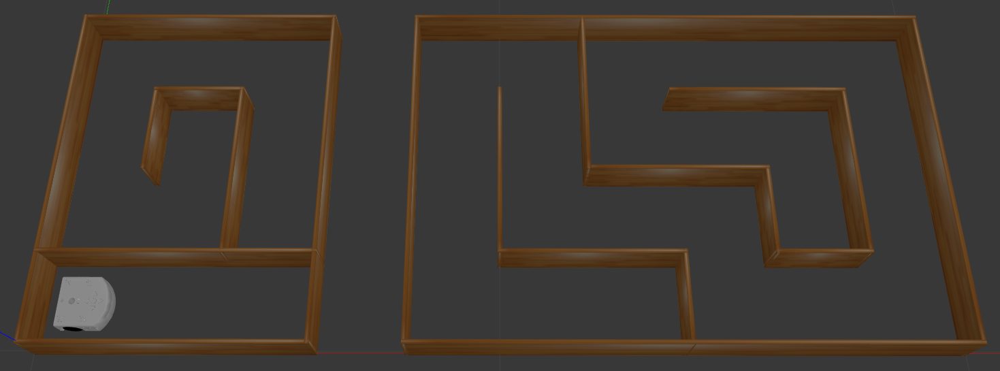
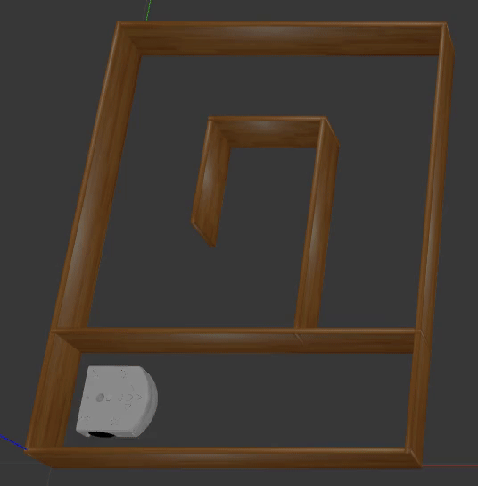
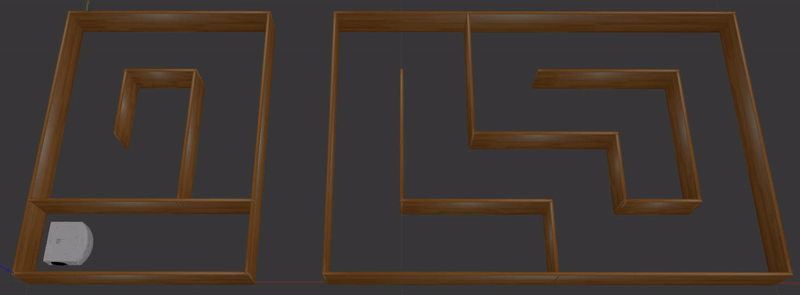
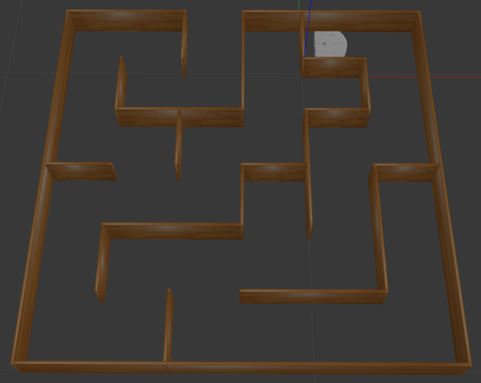

Session 3
=========

Time flies, and we are already at the final stretch of our ROS2 Basics journey. For this last session, you will bring together everything you have learned about ROS2, focusing primarily on **topics** and **services**. The objective here is not to implement complex control algorithms but rather to gain hands-on experience with ROS2’s core functionalities in the context of a mini-project.

To ensure a smooth experience for everyone, we have provided a ready-to-use package called ``thymio_mini_project``. This includes:

* A **Thymio model** with:

    * A **diff_drive_controller** plugin for velocity control.
    * **Proximity sensors** (front and rear) for obstacle detection.

* A **Gazebo world** with a pre-defined maze to work on.

.. |spacer| raw:: html

    

|spacer|

.. admonition:: Action Required

    Please :download:`Download <downloads/thymio_mini_project.zip>` the ``thymio_mini_project`` package required for this session and place it in the ``/src`` directory of your ``ros2_basics_ws`` workspace.

Thymio Mini-Project Overview
----------------------------

The task is to guide the Thymio robot through two parts of a maze. The maze is designed to focus on ROS2 rather than navigation algorithms. To make things straightforward:

* Each turn in the maze is unambiguous, with only one clear direction to follow, marked by a wall directly in front of the robot.
* At dead ends, the robot does not need to turn backward. Instead, it either executes a specific action to proceed further or comes to a definitive stop.
* Your job is to send the appropriate velocity commands via topics and use services to manage the robot’s position when moving between the two maze sections.
* Use the provided diff_drive_controller plugin for velocity control and the proximity sensors to detect walls.

|spacer|

Here’s a quick overview of the tasks:

1. Guide the Thymio to the end of the first maze section and stop it in front of the wall.
2. Use the provided services to transport the robot to the second maze section.
3. Continue controlling the Thymio until it reaches the second dead end and stops.

Let’s dive in and take on the challenge!

Thymio Mini-Project
-------------------

.. admonition:: Useful Material

    Don't hesitate to consult the `Cheatsheet <https://micro-453-ros2-basics.readthedocs.io/en/latest/cheatsheet.html>`_ section, where you will find useful commands and fundamental ROS2 structures to help you complete the mini-project effectively.

Step 1
~~~~~~

Setup a *thymio controller* node. 

.. admonition:: Test

    Make sure the node is started when you run it.

Step 2
~~~~~~

Update the *thymio controller* node to send velocity commands at 10 Hz, making the Thymio move forward in the Gazebo world at a speed of 10 cm/s.

.. tip::

    Remember, you can use ROS2 command-line tools to access details about the active topics and services. To do so, ensure the Gazebo simulation is running.

.. admonition:: Test

    1. Launch the simulation with the following command:

    .. code-block:: bash

        ros2 launch thymio_mini_project thymio_display.launch.xml

    2. Run your controller node.

    Verify that the Thymio moves forward at the specified speed.

Step 3
~~~~~~

Enhance the controller to stop the Thymio 5 cm away from the first wall.

.. tip::

    * Add a method to adjust velocity commands based on the distance to the wall (e.g. ``move_until_wall(velocity_command, distance_to_wall)``).
    * Use the proximity sensor data (defined as a 2D scan) and focus on the front ray.
    * If the sensor detects no obstacle, you may receive a string message. Convert it to a float if needed: ``float('string_msg')``.
    * Slow down the robot as it approaches the wall for precise stopping.
    * To log messages in the terminal with a variable displayed to a specific precision, use the following syntax:

    .. code-block:: python

        self.get_logger().info(f"The variable value is: {self.variable_:.3f} (formatted to 3 decimal places).")

.. admonition:: Test

    Run the simulation and confirm that the Thymio stops reliably 5 cm away from the wall.

Step 4
~~~~~~

Once the Thymio effectively stops in front of the first wall, prepare it to transition to the second portion of the maze. The first task is to remove the existing Thymio entity from the simulation.

.. admonition:: Test

    Run the simulation and verify that the Thymio is successfully deleted after stopping at the dead end.  

Step 5
~~~~~~

Complete the transition by spawning a new Thymio entity in the second part of the maze at the coordinates ``(x=0.5, y=0.3, yaw=pi/2)``. 

.. tip:: 

    * Ensure that the new Thymio entity is spawned only after the first entity has been successfully deleted.  
    * Use the ROS2 service for spawning by providing the URDF for the Thymio model. The following Python snippet demonstrates how to process the xacro file, generate the URDF, and store it in the ``self.robot_description_`` attribute.

    .. code-block:: python

        import os
        import xacro
        import tf_transformations
        from ament_index_python.packages import get_package_share_path

        class YourNode(Node):
            def __init__(self):
                super().__init__("your_node")
                
                urdf_path = os.path.join(get_package_share_path('thymio_mini_project'), 'urdf', 'thymio.urdf.xacro')
                self.robot_description_ = self.process_xacro_file(urdf_path)

                self.get_logger().info("Your Node has been started!")

            def process_xacro_file(self, xacro_file_path):
                try:
                    # Process the xacro file
                    xacro_parsed = xacro.process_file(xacro_file_path)
                    urdf_xml = xacro_parsed.toxml()
                    self.get_logger().info("Processed xacro file successfully.")
                    return urdf_xml
                except Exception as e:
                    self.get_logger().error(f"Failed to process xacro file: {e}")
                    raise

.. admonition:: Test

    Run the simulation and confirm that:

    * The first Thymio is deleted before the second one is spawned.  
    * The new Thymio starts in the correct position in the second maze section.  

Step 6
~~~~~~

Once the Thymio successfully spawn in the second portion of the maze, update the controller to continue the algorithm, guiding the Thymio to the next dead end where it stops definitively.

.. tip::

    * Determine the optimal stopping distance before the turns so the Thymio aligns in the center of the next corridor after turning.

    .. image:: img/thymio_maze_turn.png
        :align: center
        :width: 40%

    |spacer|

    * Add a method to handle turns (e.g. ``turn_angle(velocity_command, angle)``).

    * Choose one of the following approaches to perform the turn:
    
        * **Odometry**: Use the robot's simulated pose, which corresponds to its global position. Apply a tolerance to ensure the turn stops accurately at the desired orientation.
        * **Proximity Sensors**: Rely on the two rear proximity sensors to detect when the turn is complete. Set an appropriate tolerance to achieve precise alignment.

    * For the odometry approach, the following Python snippet might be helpful for working with angles:

    .. code-block:: python

        import math
        from tf_transformations import euler_from_quaternion

        _, _, yaw = euler_from_quaternion(quaternion)

        def wrap_angle_(self, angle):
            # Normalize angle to the range [-pi, pi]
            return (angle + math.pi) % (2 * math.pi) - math.pi

    * Implement a control strategy that guides the Thymio to the dead end and brings it to a stop.

.. admonition:: Test

    Run the simulation and verify that the Thymio:

    * Moves forward on clear paths
    * Turns left when unable to move forward and the dead end is not reached
    * Stops properly at the dead end

Feedback Form
~~~~~~~~~~~~~

.. admonition:: Help Us Improve

    We would love to hear from you! Please complete `this form <https://forms.gle/Lv3rK9z7fncKoZ6Z9>`_ to share your thoughts and help us improve. Your feedback is greatly appreciated!

Step 7 - Bonus
~~~~~~~~~~~~~~

As a bonus challenge, you can try to generalize your controller to handle a more complex maze. 

|spacer|

Enhance your control strategy to allow the Thymio to navigate autonomously:

* The Thymio should move forward as long as no obstacles are detected in front.
* When a wall is detected directly ahead, it must decide whether to turn left or right based on the available paths (note that only one direction or none will be possible, never both).
* When the Thymio reaches the dead end, it should stop.

The new spawn coordinates are ``(x=1.3, y=0.1, yaw=pi)``. 

.. tip::

    * Decide the appropriate moment to determine the turn direction. This may require updating one of the previous methods.
    * Use the lateral proximity sensors to decide which side to turn, keeping in mind that their angled placement limits their ability to detect walls directly beside the robot.

    .. image:: img/thymio_sensors.png
        :align: center
        :width: 40%

    |spacer|

.. admonition:: Test

    Run the simulation and verify that the Thymio:

    * Moves forward on clear paths
    * Chooses the appropriate turn when facing a wall
    * Stops properly at the dead end

Congratulations on reaching this point! You have successfully completed the Thymio mini-project. Well done!

Extra - Optional
~~~~~~~~~~~~~~~~

What? This was not enough for you? If you are looking to push yourself further, try tackling an even more challenging maze. In this scenario, the goal is to reach the maze's exit. However, the previous method will not work as it requires turning only when a wall is directly in front. Instead, you will need to detect and take turns where there is no wall ahead, using for instance a **wall-following** approach. You may choose to follow either the left or the right wall.

|spacer|

The first step is to update the Gazebo world in the launch file. Open *thymio_display.launch* and apply the following modification:

.. code-block:: xml

    <include file="$(find-pkg-share gazebo_ros)/launch/gazebo.launch.py">
          <!-- <arg name="world" value="$(find-pkg-share thymio_mini_project)/worlds/two_parts_maze.world"/> -->
          <arg name="world" value="$(find-pkg-share thymio_mini_project)/worlds/maze_6x6.world"/>
     </include>

.. tip::

    * Use the lateral proximity sensors to detect openings on the chosen side (left or right).  
    * Develop a strategy to turn toward the chosen wall when an opening is detected.  
    * One possible approach is to adjust forward motion for a specific distance to ensure the robot passes through the middle of the opening. You can implement a method, such as: ``move_forward(command_velocity, distance)``, using odometry to control the motion precisely. The following function can help calculate the Euclidean distance traveled:

    .. code-block:: python

        def calculate_distance_(self, initial_position, current_position):
            # Calculate Euclidean distance
            dx = current_position['x'] - initial_position['x']
            dy = current_position['y'] - initial_position['y']
            return math.sqrt(dx**2 + dy**2)

    * Adapt your control strategy to implement a general wall-following logic, allowing the Thymio to dynamically adjust its behavior based on wall openings on the chosen side. Ensure the logic also handles dead-end scenarios by making the Thymio turn around and continue wall-following.

.. admonition:: Test

    Verify that your wall-following algorithm performs as expected. Below is an example outcome for the left-wall-following approach:

    .. image:: img/thymio_mini_project_extra.gif
        :align: center
        :width: 60%

    |spacer|
